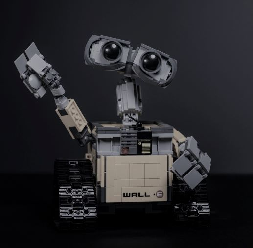

## Introduction

 My name is Karine, originally from Russia, Saint-Petersburg. Now I live in Lahti. I have a study background (university) in General Linguistics (& Finnish, Chinese linguistics) and some subjects of Language technology. Now, my major is Language Technology, the Master’s Programme Linguistic Diversity and Digital Humanities (LingDig). 
Language technology combines linguistics, computer science, information technology, mathematics, cognitive science, phonetics, psychology, translation studies and research artificial intelligence.  
## Find me on

[LinkedIn](https://fi.linkedin.com/mouse-mousekewitz), [GitHub](https://github.com/mokewitz)

## Contact

My email address is of the form first_name.last_name@helsinki.fi. 

## Courses I've Taken

[Enjoying Cheese I](https://courses.helsinki.fi/enjoying-cheese-I), fall 2018

[Feline Avoidance](https://courses.helsinki.fi/feline-avoidance), fall 2018

## Projects

## Misc. 

[Gotta Love Cheese](https://en.wikipedia.org/wiki/Cheese) 
